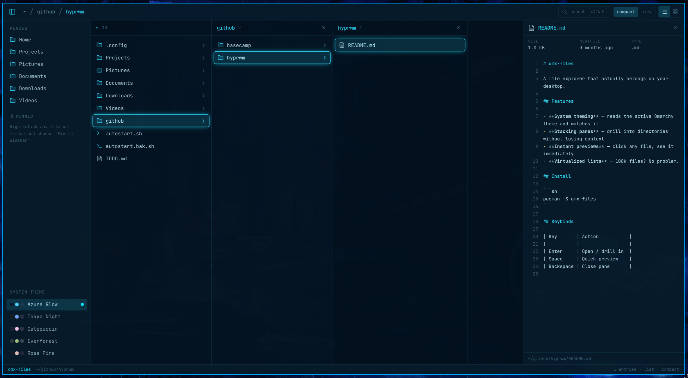

# Strata

**Navigate every layer.**

Strata is an experimental, keyboard-first file manager for Linux. It is designed primarily for Omarchy while remaining portable to other modern Linux environments.

## North Star



> This is the original product concept, not a screenshot of the current build. It guides Strata's navigation, information density, theming, and preview experience.

## Vision

- Miller-column navigation
- Folder peeking on hover
- Ultra-fast search
- Rich file previews
- Collapsible sidebar
- Compact and airy density modes
- List and grid views
- Omarchy and system theming
- Complete keyboard navigation

## Documentation

- [Product requirements](docs/prd.md) — product North Star
- [Roadmap](docs/roadmap.md) — milestone sequence and exit criteria
- [Work breakdown](docs/todo.md) — actionable project checklist
- [Architecture principles](docs/architecture.md) — boundaries and customization strategy
- [Prototype design reference](docs/design-reference.md) — visual tokens, motion, and interaction baseline
- [Initial technical direction](docs/technical-direction.md) — original technical assessment

## Technology

- Rust
- GTK4
- GIO
- Native Wayland support

## Development

### Requirements

- Rust 1.85 or newer
- GTK 4.12 or newer
- Fontconfig
- A C toolchain and `pkg-config`

On Arch Linux:

```bash
sudo pacman -S --needed base-devel rust fontconfig gtk4
```

Run Strata:

```bash
cargo run
```

Run the standard quality checks:

```bash
./scripts/check.sh
```

The script always runs formatting, compilation, Clippy, and tests. It also runs dependency-policy and spelling checks when `cargo-deny` and `typos` are installed. CI runs the complete suite, including the minimum supported Rust version.

## Bundled assets

Strata includes a curated Lucide icon subset and the regular JetBrains Mono variable font. See [third-party notices](THIRD_PARTY_LICENSES.md) for versions, modifications, and complete attribution.

## Status

Strata is at the technical-spike stage. The first objective is to validate responsive Miller columns, cancellable hover peeking, incremental directory enumeration, and previews in very large directories.

## License

Strata is licensed under the [GNU General Public License v3.0 or later](LICENSE).
